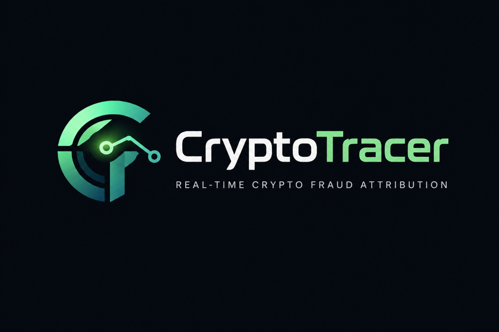
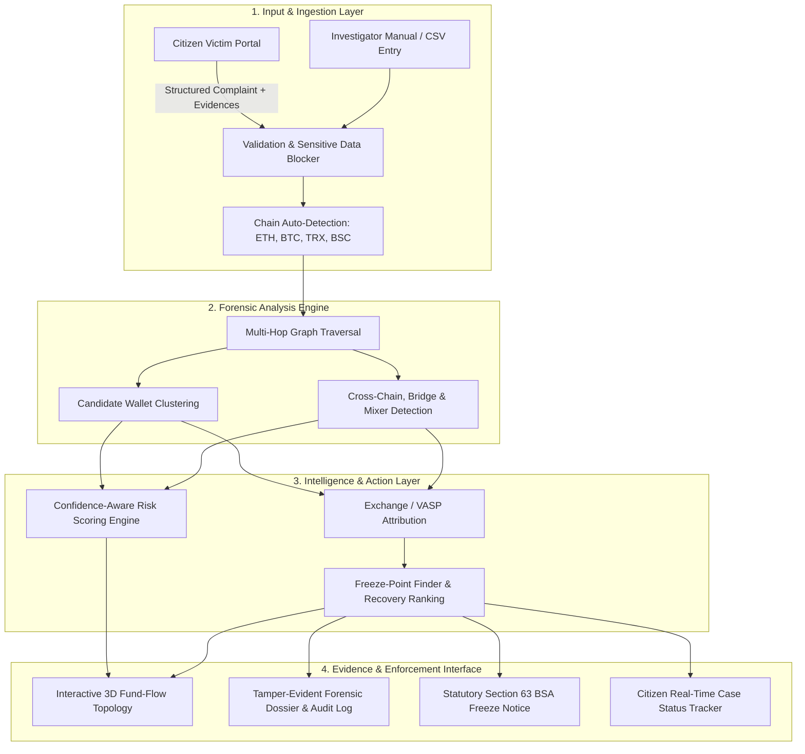

<p align="center">
  
</p>

<h1 align="center">CryptoTracer</h1>
<h3 align="center">Real-Time Crypto Fraud Attribution & Golden Hour Recovery System</h3>
<p align="center">
  <em>Developed by <strong>Team Modak_v21</strong></em>
</p>

<p align="center">
  
  
  
  
  
  
  
</p>

<p align="center">
  <strong>CryptoTracer</strong> bridges the gap between distressed cybercrime victims and forensic investigators. It provides a cryptographically secure victim intake portal and a powerful multi-hop transaction tracing engine to reconstruct fraud networks, identify Exchange/VASP endpoints, and trigger legal holds within the critical <strong>"Golden Hour."</strong>
</p>

<p align="center">
  <strong><em>"Not just 'Where did the money go?' but 'Who received it, where can it be frozen, and what should the investigator do next?'"</em></strong>
</p>

---

## 🎯 The Problem & Our Innovation

When a victim reports a cryptocurrency wallet used in fraud, the money is rarely still there. Funds move through burner wallets, cross-chain bridges, and mixers within minutes, while investigators traditionally spend days manually tracing blockchain explorers.

```
Manual Tracing (Before)       CryptoTracer (After)
-----------------------       --------------------
⏱️ Days to trace trail        ⚡ Actionable leads in minutes
🔍 Manual wallet-by-wallet    🌐 Unified automated multi-hop traversal
❓ Unclear where to act        🏛️ Identifies nearest VASP + Statutory Freeze Notice
```

* **Who's Affected:** Cybercrime investigators (I4C / State Cyber Cells), Fraud Victims, Exchanges/VASPs, and NCRP/SAHYOG coordination teams.
* **National Impact:** Over **₹22,495 Cr** was reported in cyber-fraud losses in India in 2025. Moving from *"Here is the suspicious wallet"* to *"Here is the fund trail and the receiving service"* within the first 60 minutes dramatically increases asset recovery success.

---

## ⚡ Core Features (Investigator Console)

* **🌐 3D Multi-Hop Transaction Topology:** Interactive Cytoscape.js visualization rendering multi-hop fund flows across Ethereum, Bitcoin, TRON, and BSC. Features radial-gradient entity nodes, 2D/3D views, and automated mixer/bridge detection.
* **⏱️ Golden Hour Recovery Engine:** Dynamic SLA countdown clock tracking strict legal milestones (`NCRP Filing` &rarr; `VASP Notice` &rarr; `Freeze Order`).
* **❄️ Freeze-Point Finder:** Identifies the nearest regulated endpoint where assets can legally be frozen (e.g. Binance, Tether, Circle) along with hop distance and recoverability confidence.
* **🧠 Complaint-to-Network Intelligence:** Automatically connects isolated victim complaints that route funds to the same intermediary clusters or terminal VASP deposit accounts.
* **📄 Cryptographic Evidence Reports & Freeze Notices:** Generates tamper-evident PDF dossiers with client-side SHA-256 evidence hashing, immutable audit trails, and statutory Section 63 BSA freeze notices ready for law enforcement handoffs.

---

## 🛡️ Citizen Victim Portal (DPDP Safe Realm)

* **🔒 Strict Data Isolation:** A dedicated, privacy-preserving portal for victims. Internal investigator intelligence (risk scores, clustering findings, VASP targets, internal notes) is strictly quarantined from public view to prevent tip-offs.
* **📝 5-Step Complaint Wizard:** Guided intake flow capturing fraud typologies, loss assets, and suspect wallets with real-time chain auto-detection.
* **🛑 Active Seed-Phrase Blocker:** Client-side heuristic validation that actively detects and blocks victims from accidentally submitting 12/24-word recovery phrases or private keys.
* **📊 6-Stage Reassuring Case Tracker:** Public, privacy-safe case tracker (`Submitted` &rarr; `Received` &rarr; `Under Verification` &rarr; `Investigation in Progress` &rarr; `Action Taken` &rarr; `Closed`) updating dynamically as officers advance the case.

---

## 🏗️ Technical Architecture



---

## 🛠️ Tech Stack

| Component | Technology | Description |
| :--- | :--- | :--- |
| **Frontend** | React 18, Vite, TypeScript, Tailwind CSS | High-performance dashboard with glassmorphic forensic styling and responsive layout. |
| **Backend** | Python 3.11+, FastAPI, Uvicorn | Async REST API handling multi-hop graph traversal, scoring, and queue orchestration. |
| **Database & Auth** | Supabase (PostgreSQL), RLS | Relational case storage, Row-Level Security, and dual-realm JWT authentication. |
| **Graphing** | Cytoscape.js | Graph visualization engine for deep blockchain transaction tree reconstruction. |
| **Reporting** | ReportLab, Python Web Crypto | Court-admissible PDF generation with SHA-256 integrity verification. |
| **Containerization** | Docker, Docker Compose | Multi-container setup for one-command hermetic deployment. |

---

## 🚀 Quick Start (Local Setup)

### 1. Clone the Repository
```bash
git clone https://github.com/samruddhigangane17/crypto-fraud-attribution.git
cd crypto-fraud-attribution
```

### Option A: Run via Docker Compose (Recommended)
```bash
# Build and start all services
docker compose up --build
```
- **Investigator Console & Victim Portal:** `http://localhost:5173`
- **FastAPI Interactive Docs:** `http://localhost:8000/docs`

---

### Option B: Run Locally from Source

#### 1. Backend Setup
```bash
# Set up Python virtual environment
python -m venv venv
.\venv\Scripts\activate      # Windows
# source venv/bin/activate   # macOS / Linux

# Install dependencies
pip install -r requirements.txt

# Start FastAPI backend
python -m uvicorn backend.main:app --host 127.0.0.1 --port 8000 --reload
```

#### 2. Frontend Setup (in a separate terminal)
```bash
cd frontend

# Install Node dependencies
npm install

# Start Vite dev server
npm run dev -- --host 127.0.0.1 --port 5173
```

---

## 🧪 Verification & Test Suite

The project includes **215 comprehensive automated tests** covering tracing, attribution, evidence reports, freeze notices, and the victim portal:

```bash
# Run complete test suite
pytest -q
```
```text
........................................................................ [ 33%]
........................................................................ [ 66%]
.......................................................................  [100%]
215 passed in 3.64s
```

```bash
# Verify Frontend Production Build
cd frontend
npm run build
```
```text
✓ built in 847ms (0 TypeScript/JSX errors)
```

---

## 🏛️ Target Adopters & Revenue Feasibility

* **Target Adopters:**
  * **I4C / NCRP & State Cyber Cells:** Rapid attribution and centralized victim intake triage.
  * **Exchanges / VASPs:** Compliance and AML fraud intelligence alerting.
  * **Law Enforcement Units:** Court-ready evidence reports and statutory freeze notices.
* **Commercialization Streams:**
  1. **Government Licensing:** Tiered agency licenses for state and national cybercrime command centers.
  2. **Enterprise VASP Subscriptions:** Inbound fraud-alert and Section 63 hold notification feeds.
  3. **Forensic Intelligence API:** REST endpoints for automated blockchain risk scoring and entity lookup.

---

## 👥 Team Modak_v21

---

<p align="center">
  <sub>Built with ❤️ by Team Modak_v21 for a safer, fraud-resilient Web3 ecosystem.</sub>
</p>   
